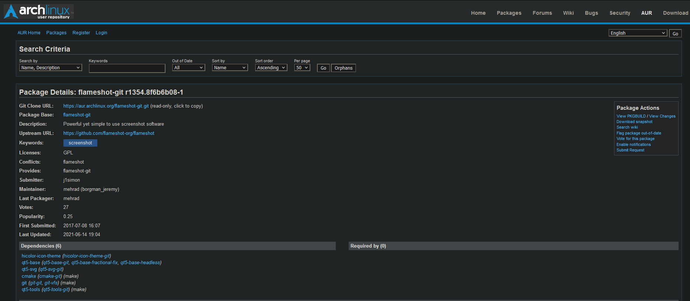

# How To Install Packages from the AUR

## Tested on

- Manjaro
- Arch

## Problem

- ``sudo pacman -S (package name)`` does not work, but you know the package is available for Arch.
- You searched it up and got a page like this:

## Reason

- The package is in the **A**rch **U**ser **R**epositories, not the official Arch repositories

## Fix

- Copy the link on the page (clicking the link automatically copies it)
- In the terminal run ``git clone LINK HERE`` (replace LINK HERE with the link you copied)
- Then run ``cd NAME-OF-PACKAGE`` (replace NAME-OF-PACKAGE with the name of the program you are trying to install)
- Then run ``makepkg -si``
- Wait for a little bit (be patient)

## The program should now be installed

- ~5late