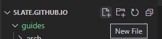
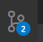
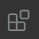
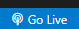

# Intro to VSCODE

## About Guide

- This guide aims to get you set up with VS Code and Git, as well as some basic extensions.
- By the end of the guide, you should have VS Code set up with Git to use for any project you'd like

## Tools & Downloads

- VS Code is available from [here](https://code.visualstudio.com/Download)
- Git is available from [here](https://git-scm.com/downloads)
- The extensions will be available from inside VS Code, and do not require external downloads

## Editing

- I would reccommend opening a *folder* with VS Code, and working inside that folder, rather than opening files, although that is possible
- To open a folder, in VS Code, click ``File`` -> ``Open Folder`` -> **Select your folder**
- From here you can create files inside the folder and edit them directly
- To create a file, hover over the name of the folder on the left side, and click the document icon with the plus sign, as shown below:

- You can name the file whatever you'd like, and end it with any suffix, as applies to the language/document type you would like the file to be

## Git

- Git is available from the left toolbar, and is an icon as shown below:

- If you have installed Git correctly, it should show up that you can create a new repository
- You can choose to create a new repository if you'd like, Git is succesfully linked with VS Code

## Extensions

- There are a number of extensions available from the VS Code Marketplace
- The extension tab should looks as shown below:

- For this guide, I will show you the **Discord Presence** and **Live Server** extensions
    - Discord Presence will show your filename and how long you've been editing on Discord, as your game activity
    - Live Server will create a hot-reload server for web development, which will automatically open in the default browser set
- Search for **Discord Presence** and click on the top one, then click Install
- Follow the same for **Live Server**
- Discord Presence should start working immediately, but may need a restart of VS Code
- Live Server will require you to click the ``Go Live`` icon at the bottom right as shown below:

#### You should now have working VS Code set up with Git, and with some basic extensions

~ 5late
